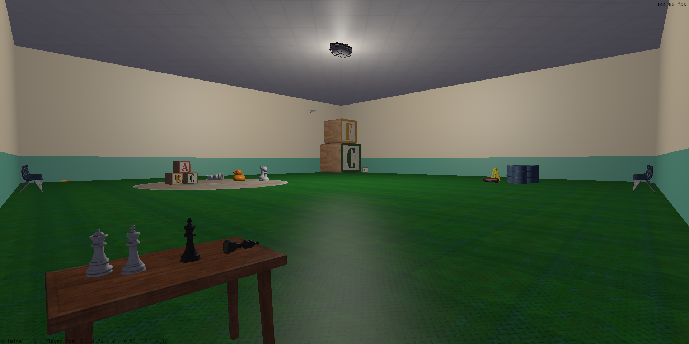
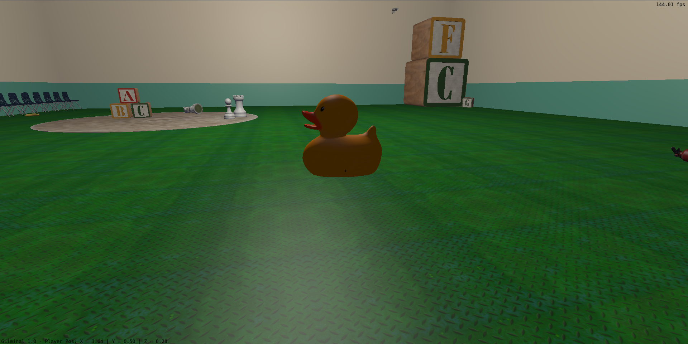
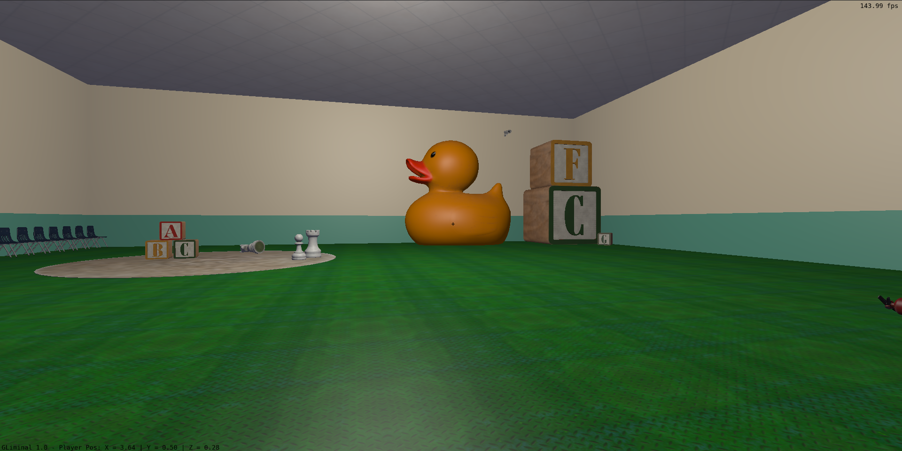
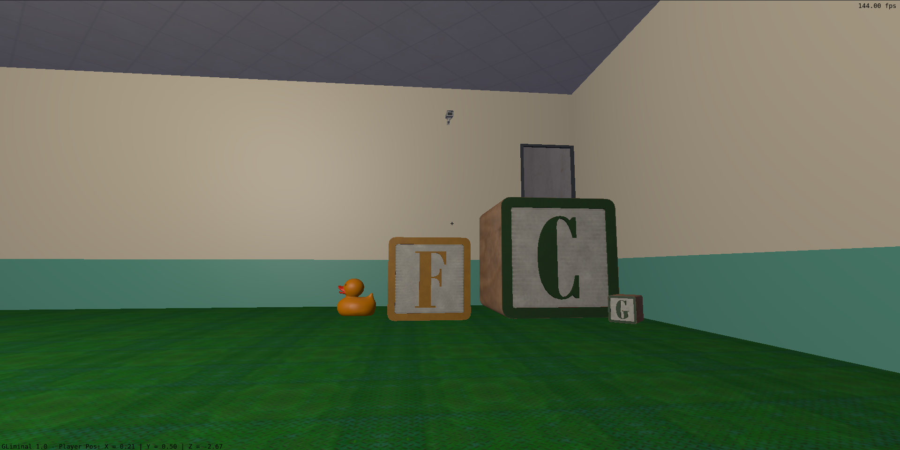
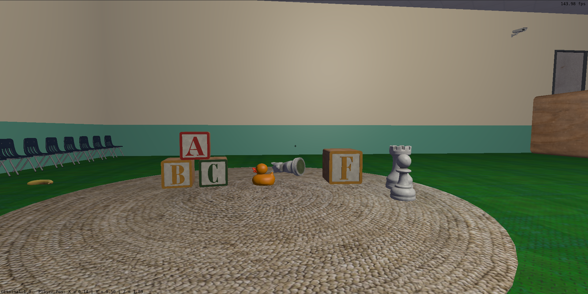
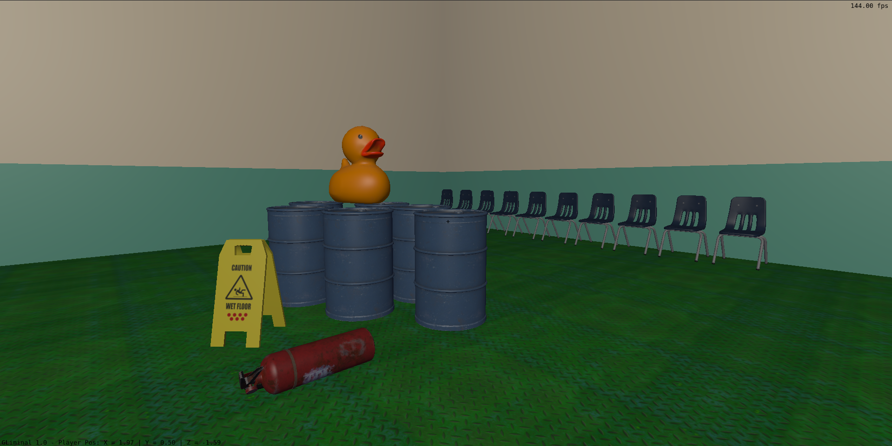
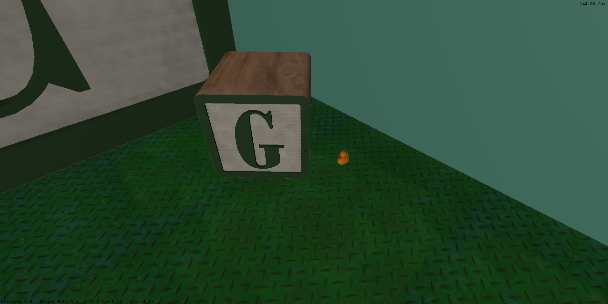
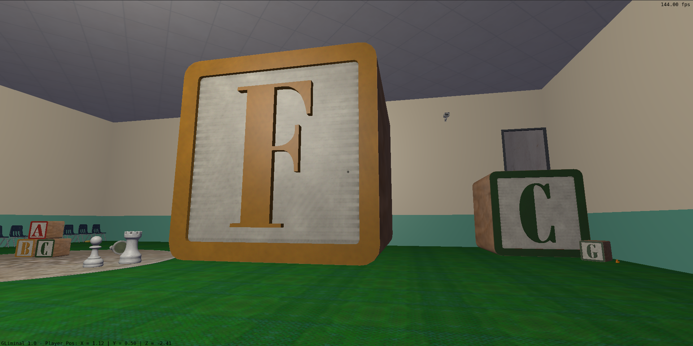

# Computação Gráfica e Visualização I (INF01047) - INF/UFRGS

## Descrição da aplicação
GLiminal é um jogo de puzzle em primeira pessoa desenvolvido em C++ com OpenGL 3.3 e GLFW, inspirado na mecânica de perspectiva forçada de Superliminal. O jogador explora um ambiente 3D repleto de objetos virtuais, podendo pegar, mover e redimensionar objetos interativos, com a escala de um objeto sendo ajustada proporcionalmente à distância em que é posicionado, criando ilusões de perspectiva para resolver quebra-cabeças espaciais.

O projeto implementa os principais fundamentos de Computação Gráfica: 
- Transformações geométricas (translação, rotação, escala) aplicadas em instâncias de objetos (mesas, cadeiras, barris, peças de xadrez, cubos, etc.) 
- Câmera virtual em primeira pessoa controlada por mouse com projeção perspectiva 
- Mapeamento de texturas (diversas texturas mapeadas em todos os objetos: madeira, metal, concreto, borracha, carpete) 
- Modelos de iluminação Blinn-Phong com fonte pontual
- Testes de colisão abrangentes (jogador vs. cenário, objetos vs. objetos, objetos vs. sala, com detecção de superfície para criar possibilidade de pisar sobre objetos)
- Animação baseada em tempo (ventilador giratório, objeto com curva de Bézier, gravidade sobre objetos e jogador)

## Teclas de atalho
- WASD - Teclas de movimento no modo corrida
- Setas - Teclas de movimento no modo caminhada
- Barra de Espaço - Pulo
- Pegar objeto (se não estiver segurando) - Botão esquerdo do mouse
- Largar objeto - Botão Esquerdo do mouse
- Movimento do mouse - Movimento da Camera

## Compilação e execução da aplicação
Compilação padrão do projeto com `cmake --workflow --preset configure-build-run`, instruções detalhadas em [COMPILACAO](COMPILACAO.md)

## Imagens mostrando o funcionamento da aplicação

## Link para demonstração em vídeo
https://www.youtube.com/watch?v=LW8fwMzFa50
