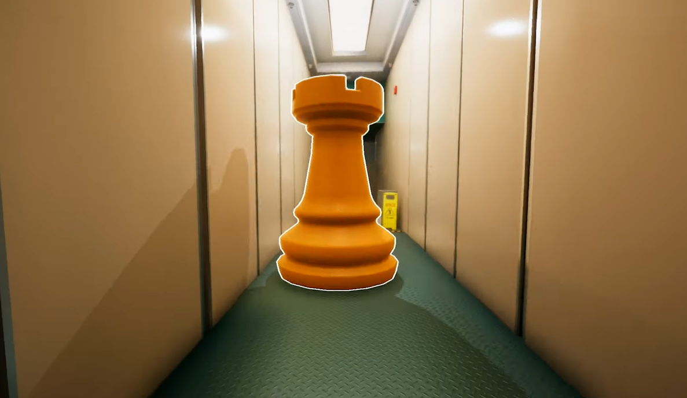
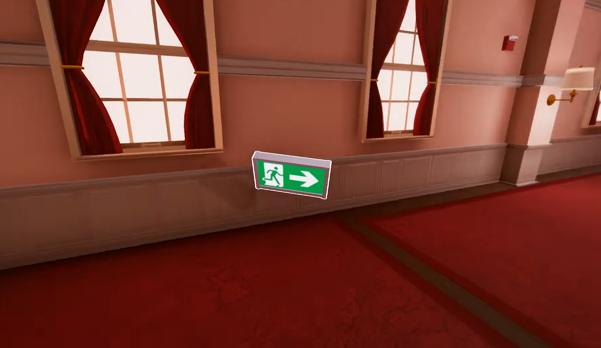
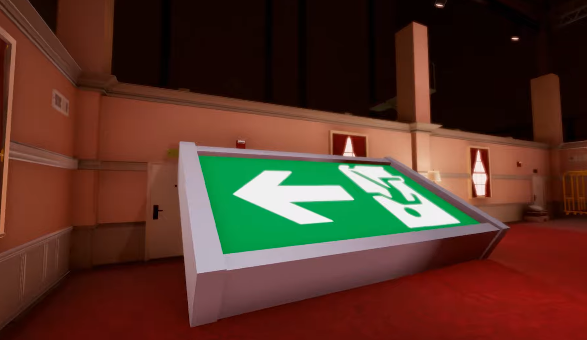

# Especificação da Implementação

> [!CAUTION]
> - Você <ins>**não pode utilizar ferramentas de IA para escrever esta
>   especificação**</ins>

## Integrantes da dupla

- **Aluno 1 - Nome**: Felipe Pasinato Rossoni
- **Aluno 1 - Cartão UFRGS**: 587631

## Detalhes do que será implementado

- **Título do trabalho**: GLiminal
- **Parágrafo curto descrevendo o que será implementado**: Uma aplicação inspirada no jogo Superliminal, focada em quebra-cabeças onde o tamanho e a posição dos objetos no mundo 3D são alterados dinamicamente com base na perspectiva e no ponto de vista do jogador.

## Especificação visual

### Vídeo - Link

> [!IMPORTANT]
> - Coloque aqui um link para um vídeo que mostre a aplicação gráfica
>   de referência que você vai implementar. **Sua implementação deverá
>   ser o mais parecido possível com o que é mostrado no vídeo (mais
>   detalhes abaixo).**
> - **Você não pode escolher como referência: (1) algum trabalho realizado
>   por outros alunos desta disciplina, em semestres anteriores. (2) Minecraft.**
> - Por exemplo, você pode colocar um vídeo de um jogo que você gosta,
>   e seu trabalho final será uma re-implementação do jogo.
> - O vídeo pode ser um link para YouTube, Google Drive, ou arquivo mp4 dentro
>   do próprio repositório. Mas, garanta que qualquer um tenha
>   permissão de acesso ao vídeo através deste link.

https://youtu.be/Jv-yXlqsbJc?si=vGWDmeQ_S8UFJhVQ&t=5

### Vídeo - Timestamp

> [!IMPORTANT]
> - Coloque aqui um **intervalo de ~30 segundos** do vídeo acima, que
>   será a base de comparação para avaliar se o seu trabalho final
>   conseguiu ou não reproduzir a referência.

- **Timestamp inicial**: 00:05
- **Timestamp final**: 00:35

### Imagens

> [!IMPORTANT]
> - Coloque aqui **três imagens** capturadas do vídeo acima, que você
>   irá usar como ilustração para as explicações que vêm abaixo.

## Especificação textual

Para cada um dos requisitos abaixo (detalhados no [Enunciado do Trabalho final - Moodle](https://moodle.ufrgs.br/mod/assign/view.php?id=6018620)), escreva um parágrafo **curto** explicando como este requisito será atendido, apontando itens específicos do vídeo/imagens que você incluiu acima que atendem estes requisitos.

### Malhas poligonais complexas
Essas malhas serão utilizadas com o uso de modelos 3D de objetos do cenário, como caixas, peças de xadrez, paredes, entre outros.

### Transformações geométricas controladas pelo usuário
O usuário poderá realizar transformações geométricas de objetos ao segurá-los, aplicando a mecânica central do jogo de escalonar o objeto de acordo com a distância da câmera.

### Diferentes tipos de câmeras
1. Câmera em primeira pessoa
2. Câmera look-at do objetivo

### Instâncias de objetos
Objetos do cenário, como paredes, luminárias, mesas, caixas e outros serão renderizados em múltiplos pontos do cenário com diferentes matrizes.

### Testes de intersecção
Serão realizados testes de colisão para garantir que o jogador ou os objetos não atravessem os limites do cenário.

### Modelos de Iluminação em todos os objetos
Será feita a iluminação em todos os objetos do ambiente através de luzes no teto.

### Mapeamento de texturas em todos os objetos
O mapeamento de texturas deve ser aplicado de forma correta com a aplicação de texturas de materiais, como madeira, carpete e metal em todas as superfícies.

### Movimentação com curva Bézier cúbica
Objetos decorativos podem seguir uma trajetória suave de movimento, com sua movimentação definida através de uma curva de Bézier cúbica.

### Animações baseadas no tempo ($\Delta t$)
Todas movimentações e animações serão multiplicados pelo $\Delta t$ para garantir velocidade constante (independente do FPS).

## Limitações esperadas

> [!IMPORTANT]
> - Coloque aqui uma lista de detalhes visuais ou de interação que
>   aparecem no vídeo e/ou imagens acima, mas que você **não pretende
>   implementar** ou que você **irá implementar parcialmente**.
> - Para cada item, **explique por que** não será implementado ou por
>   que será implementado parcialmente.

- As sombras dinâmicas do jogo serão excluídas do projeto ou implementadas de forma simples devido à sua complexidade.
- Objetos não terão gravidade e física muito complexas, apenas detecção de colisão e posicionamento espacial.
- A quantidade de fases será reduzida para 2 ou 3 fases para que o trabalho possa ser concluído até a data limite.
- O projeto não terá narração e nem uma história, algo presente no jogo original.
